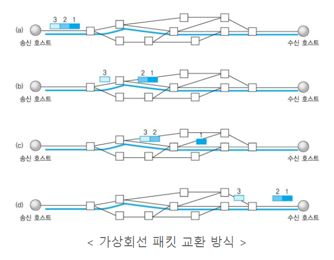

- # **TCP 와 UDP 차이**

  ### TCP vs UDP

  | 프로토콜       | TCP                | UDP                       |
  | -------------- | ------------------ | ------------------------- |
  | 연결 방식      | 연결형 서비스      | 비연결형 서비스           |
  | 패킷 교환 방식 | 가상 회선 방식     | 데이터그램 방식           |
  | 전송 순서      | 전송 순서 보장     | 전송순서가 바뀔 수 있음   |
  | 수신 여부 확인 | 수신 여부를 확인함 | 수신 여부를 확인하지 않음 |
  | 통신 방식      | 1:1 통신           | 1:1 or 1:N or N:N 통신    |
  | 신뢰성         | 높다               | 낮다                      |
  | 속도           | 느리다             | 빠르다                    |

  

  ### TCP 가상회선 패킷 교환 방식

  

  > **패킷(Packet)이란?** pack 과 bucket의 합친 말로서, 컴퓨터 간에 데이터를 주고 받을 때, 네트워크를 통해서 전송되는 데이터 조각. 이렇게 패킷으로 나누지 않으면 데이터 전달에 비효율성이 발생.

  

  ### UDP 데이터그램 방식

  

  

  ### 흐름제어(Flow Control)과 혼잡제어(Congestion Control)

  - 흐름제어

    - 데이터를 송신하는 곳과 수신하는 곳의 데이터 처리 속도를 조절하여, 수신자의 버퍼 오버플로우를 방지

  - 혼잡제어

    - 네트워크 내의 패킷 수가 넘치게 증가하지 않도록 방지하는 것. 정보의 소통량이 과다하면 패킷을 조금만 전송하여 혼잡 붕괴 현상이 일어나는 것을 막음.

      

  ### 참고 자료

  [TCP와 UPD 차이](https://mangkyu.tistory.com/15)

  [TCP와 UPD 차이2](https://velog.io/@hidaehyunlee/TCP-와-UDP-의-차이)