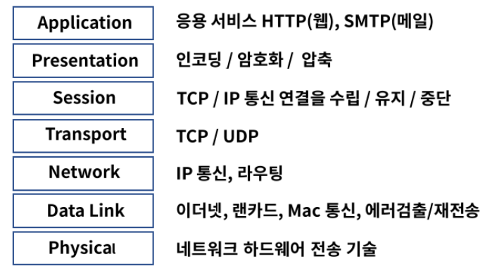
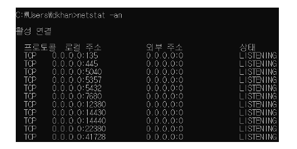
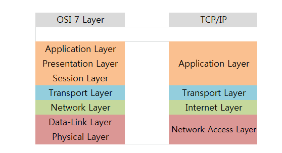

# OSI 7 Layer

### 정의

- Open Systems Interconnection Reference Model
- 네트워크 프로토콜과 통신을 7 계층으로 표현

### 목적

- 프로토콜을 기능별로 나누고 계층 별로 구분

- 벤더(제조사)간 호환성을 위한 표준 필요 → 쉬운 접근성으로 기술의 발전
- 통신 과정 중에 특정한 곳에 이상이 생길 경우, 다른 단계의 장비 및 소프트웨어 등을 건드리지 않고 통신 장애를 일으킨 단계에서 해결 가능

### 역사

1970년대 초 네트워크는 정부 또는 특정 벤더에서 독점 개발, 공개형 모델 필요

1970년대 말 ISO(국제 표준화 기구)에 의해 관리

1984년 ISO 7498 릴리즈

- PDU(Process Data Unit)
  - 각 계층에서 전송되는 단위
  - 1계층 : Bits
  - 2계층: Frames
  - 3계층: Packets
  - 4계층: Segments
  - 5~7계층: Data

- 각 계층별 프로토콜 기능
  - 분할: 큰 용량의 데이터를 전송하기 위해 데이터를 나누는 기능
  - 재조립: 분할된 데이터를 사용하기 위해 재조립 하는 기능
  - 캡슐화: 각 계층을 거칠 때마다 각 계층의 헤더가 계층별로 붙으며, 캡슐화를 진행
  - 순서 제어: 전송되는 데이터의 순서를 조율하고 이를 통해 데이터가 중복되거나 유실되는지 체크
  - 흐름 제어: 송신되는 데이터의 양과 전송률을 제한하는 기능
  - 오류 제어: 데이터가 올바르게 수신되었는지 에러 검출 코드를 통해 체크하는 기능

### 1계층 - 물리 계층 (Physical Layer)

- 실제 장치를 연결하기 위한 전기적 및 물리적 세부 사항을 정의한 계층
  - 통신 케이블로 전기적 신호를 전송
- 디지털 bit(0 & 1)를 전기, 무선 또는 광 신호로 변환 (그 반대도)
- 전송되는 방법, 제어신호, 기계적 속성 등을 정의
  - 케이블 종류, 무선 주파스 링크, 핀 배치, 전압, 물리 요건 등
-  인터페이스, 허브, 리피터 등이 이에 속함

### 2계층 - 데이터 링크 계층 (Data Link Layer)

- 동일 네트워크 내에서 데이터 전송, 링크를 통해서 연결을 설정하고 관리
- 물리계층을 통해 송수신되는 정보의 오류와 흐름을 관리하여 안전한 정보 전달을 수행할 수 있도록 도와줌
- 맥 주소(Mac Address)로 통신
- 두 지점(장치) 간의 신뢰성 있는 전송을 보장하기 위한 계층
- MAC(Media Access Control), LCC(Logical Link Control)
- 모뎀, 스위치, 브리지

### 3계층 - 네트워크 계층 (Network Layer)

- 다른 네트워크로 데이터 전송, IP(Internet Protocol)주소로 통신
- 출발지 IP에서 목적지 IP로 데이터 통신 시 중간에서 라우팅 처리
- 데이터가 큰 경우 분할(패킷) 및 전송 후 목적지에서 재조립하여 메시지 구현
- L3스위치, 라우터
- IP, 라우팅, OSFP, BGP 등

### 4계층 - 전송 계층 (Transport Layer)

- 호스트 간의 데이터(서비스) 전송
- 오류 복구 및 흐름 제어, 완벽한 데이터 전송을 보장
- L4 계층을 특정 하드웨어로 구분하기가 모호
- Port를 제어한다는 의미로 L4 로드 밸런서가 있다
- TCP,  UDP 등

### 5계층 - 세션 계층 (Session Layer)

- 로컬 및 원격 애플리케이션 간의 IP / Port 연결을 관리
- 양 끝단의 응용 프로세스가 통신을 관리하는 방법을 제공하는 계층
- 통신 연결이 손실되는 경우 연결 복구 시도가 가능하며 연결 시도중 장시간 연결이 되지 않았다면 세션 계층의 프로토콜이 연결을 닫고 다시 연결을 시도

- Session Table

​		

- TLS, SSL, 애플토크 등

### 6계층 - 표현 계층(Presentation Layer)

- 코드 간 번역을 담당하는 계층

- 사용자 프로그램과 네트워크 형식간에 데이터를 변환하여 표현과 독립성을 제공
- 전송하는 데이터의 인코딩, 디코딩, 암호화, 코드 변화
- ASCII, JPG, MPEG 등

### 7계층 - 응용 계층 (Application Layer)

- 최상위 계층으로 사용자에게 직접적으로 보이는 부분

- 사용자와 가장 밀접한 계층, 사용자 인터페이스(Interface)
- 이메일 서비스(SMTP), 또는 파일전송(FTP), HTTP

### OSI 7 Layer & TCP/IP

### 참고

[OSI 7 계층과 TCP IP 계층](https://velog.io/@inyong_pang/OSI-7-%EA%B3%84%EC%B8%B5%EA%B3%BC-TCPIP-%EA%B3%84%EC%B8%B5)

[OSI 7 Layer](https://onecoin-life.com/19)

[OSI 7 Layer 위키백과](https://ko.wikipedia.org/wiki/OSI_%EB%AA%A8%ED%98%95)

[OSI 7 Layer & TCP/IP](https://goitgo.tistory.com/25)