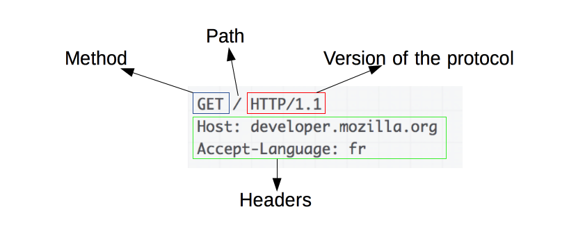

# HTTP와 HTTPS

## HTTP

### [HTTP란?]

- Hyper Text Transfer Protocol

- 서버-클라이언트 모델을 따라 데이터를 주고 받기 위한 프로토콜
- 클라이언트에서 서버의 80번 포트로 요청을 보냄
- 1989년 팀 버너스 리(Tim Berners Lee)에 의해 처음 설계

### [HTTP의 구조]

- 애플리케이션 레벨의 프로토콜로 TCP/IP 위에서 작동
- 상태를 가지고 있지 않은 Stateless 프로토콜이며 Method, Path, Version, Headers, Body 등으로 구성
- HTTP는 암호화가 되지 않은 평문 데이터를 전송하는 프로토콜, 따라서 HTTP로 비밀번호나 주민등록번호 등을 주고 받으면 제3자가 정보를 조회할 수 있음 -> 이를 해결하기 위해 HTTPS가 등장

## HTTPS

### [HTTPS]

- Hyper Text Transfer Protocol over Secure Socket Layer, HTTP over TLS, HTTP over SSL, HTTP Secure
- HTTP에 데이터 암호화가 추가된 프로토콜
- 443포트를 사용
- 네트워크 상에서 중간에 제3자가 정보를 볼 수 없도록 암호화

### [대칭키 암호와와 비대칭키 암호화]

HTTPS는 대칭키 암호화 방식과 비대칭키 암호화 방식을 모두 사용

- 대칭키 암호화
  - 클라이언트와 서버가 **동일한 키**를 사용해 암호화/복호화를 진행
  - 키가 노출되면 매우 위험하지만 연산 속도가 빠름
  - 키를 교환하는 과정에서 키가 탈취될 수 있는 문제가 있고, 사람이 증가할수록 전부 따로따로 키교환을 해야하여 관리할 키가 방대해짐
- 비대칭키 암호화
  - 1개의 쌍으로 구성된 공개키와 개인키를 암호화/복호화 하는데 사용
  - 키가 노출되어도 비교적 안전하지만 연산 속도가 느림
  - 위의 대칭키 단점을 보완하기 위한 방식

비대칭키 암호화는 공개키/개인키 암호화 방식을 이용해 데이터를 암호화. 공개키와 개인키는 서로를 위한 1쌍의 키

- 공개키: 모두에게 공개가능한 키
- 개인키: 나만 가지고 알고 있어야 하는 키

암호화를 공개키로 하느냐 개인키로 하느냐에 따라 얻는 효과가 다름. 공개키와 개인키로 암호화하면 각각 다음과 같은 효과가 있음

- 공개키 암호화: 공개키로 암호화하면 개인키로만 복호화할 수 있다. -> 개인키는 나만 가지고 있으므로, 나만 볼 수 있다.
- 개인키 암호화: 개인키로 암호화하면 공개키로만 복호화할 수 있다. -> 공개키는 모두에게 공개되어 있으므로, 내가 인증한 정보임을 알려 신뢰성을 보장할 수 있음

### [HTTPS의 동작 과정]

- HTTPS는 **대칭키 암호화와 비대칭키 암호화를 모두 사용**하여 빠른 연산 속도와 안정성을 모두 얻고 있음
- HTTPS 연결 과정(Hand-Shaking)에서 먼저 서버와 클라이언트 간에 세션키를 교환
  - 여기서 **세션키는 주고 받는 데이터를 암호화하기 위해 사용되는 대칭키**, 데이터 간의 교환에는 빠른 연산속도가 필요하므로 세션키는 대칭키로 만들어짐
- 이 세션키를 클라이언트와 서버가 어떻게 교환할 것이냐 인데, 이 과정에서 비대칭키가 사용
  - **처음 연결을 성립하여 안전하게 세션키를 공유하는 과정에서 비대칭키가 사용**, 이후에 데이터를 교환하는 과정에서 빠른 연산 속도를 위해 대칭키가 사용

실제 HTTPS 연결 과정이 성립되는 흐름

1. 클라이언트(브라우저)가 서버로 최초 연결 시도를 함
2. 서버는 공개키(엄밀히는 인증서)를 브라우저에게 넘겨줌
3. 브라우저는 인증서의 유효성을 검사하고 세션키를 발급함
4. 브라우저는 세션키를 보관하며 추가로 서버의 공개키로 세션키를 암호화하여 서버로 전송함
5. 서버는 암호화된 세션키를 개인키로 복호화하여 세션키를 얻음
6. 클라이언트와 서버는 동일한 세션키를 공유하므로 데이터를 전달할 때 세션키로 암호화/복호화를 진행함

### [HTTPS의 발급 과정]

서버는 클라이언트와 세션키를 공유하기 위한 공개키를 생성해야함. 일반적으로는 인증된 기관(Certificate Authority)에 공개키를 전송하여 인증서를 발급받음

1. A서버에서 HTTP 기반의 애플리케이션에 HTTPS를 적용하기 위해 공개키/개인키를 만듬
2. 신뢰할 수 있는 CA 기업을 선택하고 그 기업에 내 공개키를 관리해달라고 계약하고 돈을 지불함
3. CA기업은 또 CA 기업만의 공개키와 개인키가 있음
   CA 기업은 CA기업의 이름, A 서버의 공개키, 공개키의 암호화 방법 등의 정보를 담은 인증서를 생성하고, 해당 인증서를 CA 기업의 개인키로 암호화하여 A기업에게 이를 제공
4. A기업은 클라리언트에게 암호화된 인증서를 제공
5. 브라우저는 CA기업의 공개키를 미리 다운받아 갖고 있어, 암호화된 인증서를 복호화함
   세계적으로 신뢰할 수 있는 CA기업의 공개키는 브라우저가 이미 알고 있음!
6. 브라우저가 CA 기업 리스트를 쭉 탐색하면서 인증서에 적혀 있는 CA 기업 이름이 같으면 해당 CA기업의 공개키를 이미 알고 있는 브라우저는 복호화해서 A서버의 공개키를 얻을 수 있음
7. 클라이언트는 A서버와 통신할 때는 A기업의 공개키로 세션키를 공유

HTTPS를 지원한다고 해서 무조건 안전한 것은 아님.

- 신뢰할 수 있는 CA기업이 아니라 자체적으로 인증서를 발급할 수도 있고, 신뢰할 수 없는 CA 기업을 통해서 인증서를 발급받을 수도 있기 때문
- 그러면 브라우저에서는 https지만 "주의 요함", "안전하지 않은 사이트"등의 알림을 주게됨

## HTTP와 HTTPS의 차이

- HTTP는 암호화가 되지 않았기 때문에 보안이 취약한 반면, HTTPS는 데이터가 암호화되어 안전함
- HTTPS를 이용하면 암호화/복호화 과정 때문에 HTTP보다 속도가 느림(사용자 입장에서는 큰차이 못느낌)
- HTTPS는 인증서를 발급하고 유지하기 위한 추가 비용이 발생
  - 민감한 개인정보를 주고 받는 서비스에서는 HTTPS를 사용하고,  그렇지 않다면 HTTP 사용

### 참고

[HTTP와 HTTPS의 개념 및 차이점](https://mangkyu.tistory.com/98)

[대칭키 vs 공개키(비대칭키) 암호화 차이](https://liveyourit.tistory.com/183)

[How Does HTTPS Work? RSA Encryption Explained](https://tiptopsecurity.com/how-does-https-work-rsa-encryption-explained/)

[HTTPS와 HTTPS 이해와 차이점 그리고 오해(?)](https://jeong-pro.tistory.com/89)

[https와 https의 차이](https://velog.io/@bclef25/http%EC%99%80-https%EC%9D%98-%EC%B0%A8%EC%9D%B4)