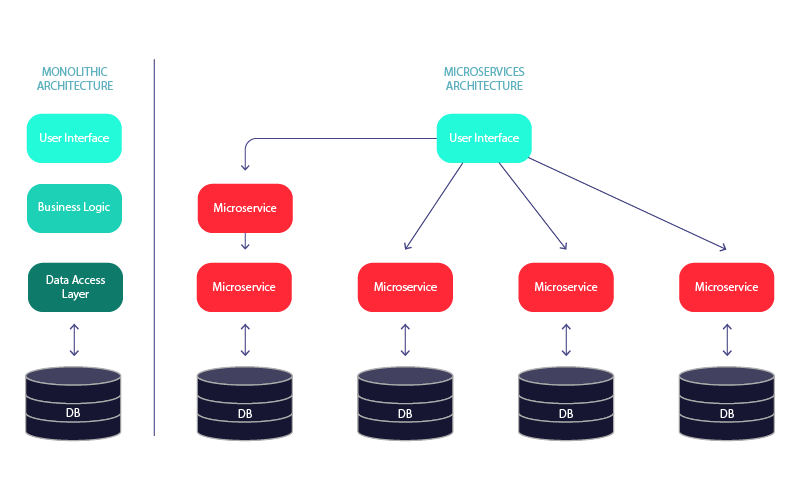
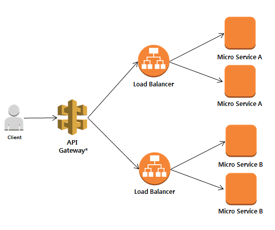

# 마이크로서비스 아키텍처(MSA)

> 커다란 어플리케이션을 독립적으로 배포 가능한 각각의 기능을 수행하는 여러개의 작은 어플리케이션으로 나눈 아키텍처

### Monolithic Architecture

- 소프트웨어의 모든 구성요소가 한 프로젝트에 통합되어 있는 형태
- 동일한 개발 툴을 사용해 개발되며 개포 및 테스트도 하나의 애플리케이션만 수행하면 되기 때문에 개발 및 환경설정이 간단하다.
- 각 컴포넌트들이 함수로 호출 되기 때문에 성능에 제약이 덜하고, 운영 관리가 용이하다.
- 주로 소규모 프로젝트에서 사용

### Monolithic Architecture 한계

일정 규모 이상의 서비스, 혹은 수백명 이상의 개발자가 투입되는 프로젝트에서 Monolithic Architecture는 다음과 같은 한계를 보인다.

- 빌드/테스트 시간이 길어진다.
  - 작은 수정에도 시스템 전체를 빌드해야 하며 수정에 대한 영향도 파악이 힘들다.또한, 테스트 시간도 길어진다. 요즘처럼 CI/CD가 강조되는 시점에서는 큰 문제가 될 수 있다.

- 부분 장애가 전체 서비스의 장애로 확대될 수 있다.
  - 개발자의 잘못된 코드 배포 or 갑작스런 트래픽 증가로 인해 성능에 문제가 생겼을 때, 서비스 전체의 장애로 확대될 수 있다.
- 부분적인 Scale-out이 어렵다.
  - 사용량이 적은 다른 서비스도 모두 Scale-out 되어야 하기 때문에 부분 Scale-out이 어렵다.
- 하나의 Framework와 언어에 종속적이다.

이러한 문제점들을 보완하기 위해서 MSA가 등장하게 되었다. 기존에 물리적인 서버에 서비스를 올리던 on-promise 서버 기반의 Monolithic Architecture에서 이제는 AWS와 같은 클라우드 환경을 이용하여 서버를 구성하는 MicroService Architecture로 많은 서비스들이 전환되고 있다.

### MSA의 특징

단일 프로그램을 각 컴포넌트 별로 나누어 작은 서비스의 조합으로 구축하는 방법

- 제대로 설계된 마이크로서비스는 하나의 기능만 수행한다. 그리고 이는 재사용할 수 있어야 한다.
- 기술 중립적 프로토콜을 사용해 통신하므로 다양한 언어와 기술로 구축할 수 있다.
- 각 서비스는 개별 프로세스로 구동되며, REST 등 같은 가벼운 통신 아키텍처 또는 Kafka 등을 이용한 message stream을 주로 사용한다.
- 하나의 DB에 중앙 집중화를 하지 않고, 서비스 별 별도의 데이터 베이스를 사용한다.
- 각각의 서비스는 독립적으로 배포된다.

**API Gateway**

- MSA는 각 서비스가 다른 서버에 분리되어 있기 때문에 서버 URL이 각기 다르다. 
- 이때 API Gateway는 API 서버 앞단에서 모든 API 서버들의 End-Point를 단일화하여 묶어주는 역할을 한다. 
- 그리고 거미줄처럼 복잡한 서비스간의 API호출 구조도 단순화 시켜준다.
- 이외에 라우팅, 로드밸런싱, 인증 역할 등의 역할을 수행한다.

### MSA 장점

- 빠른 배포
  - 서비스마다 독립적으로 배포가 가능해, 배포 시 전체 서비스의 중단이 없으며 요구사항을 신속하게 반영하여 빠르게 배포할 수 있다.
- 확장성이 좋다
  - 서비스의 부하에 따라 개별적으로 scale-out이 가능하여, scale-out이 효율적이다.
- 장애가 전체 서비스로 확장될 가능성이 적다.
  - 부분적 장애에 대한 격리가 수월하다.
- 신기술의 적용이 유연하고, 서비스를 polyglot하게 개발/운영할 수 있다.

### MSA 단점

- 성능
  - 서비스 간 호출 시 API를 사용하기 때문에, 통신 비용이나 Latency가 그만큼 늘어난다.
- 통합 테스트가 어렵다.
  - 여러 서비스가 다른 서버에 있기 때문에 통합 테스트가 어렵다. 따라서 개발 환경과 실제 운영환경을 동일하게 가져가는 것이 쉽지않다.
-  트랜잭션 유지가 어렵다.
  - 모놀리식에서는 단일 트랜잭션을 유지하면 됐지만, MSA에서는 비즈니스에 대한 DB를 가지고 있는 서비스도 각기 다르고, 서로 다른 서비스의 연결을 위해서는 통신이 포함되기 때문에 트랜잭션을 유지하는게 어렵다.
- 데이터 관리
  - 데이터가 여러 서비스에 걸쳐 분산되기 때문에 한번에 조회하기 어렵고, 데이터의 정합성 또한 관리하기 어렵다.

### 참고

[[MSA\] MSA란 무엇인가? 개념 이해하기](https://wooaoe.tistory.com/57)

[마이크로서비스 아키텍처(MSA) 개념 소개](http://clipsoft.co.kr/wp/blog/%EB%A7%88%EC%9D%B4%ED%81%AC%EB%A1%9C%EC%84%9C%EB%B9%84%EC%8A%A4-%EC%95%84%ED%82%A4%ED%85%8D%EC%B2%98msa-%EA%B0%9C%EB%85%90/)

[Monolithic vs Microservice — Which one to chose in app development?](https://medium.com/geekculture/monolithic-vs-microservice-which-one-to-chose-in-app-development-446646718d0)

[API Gateway](https://www.msaschool.io/operation/architecture/architecture-one/)