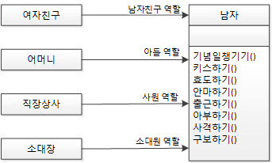
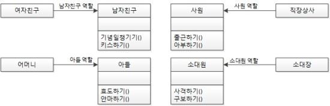
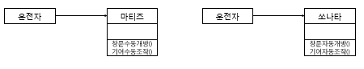
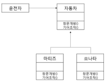
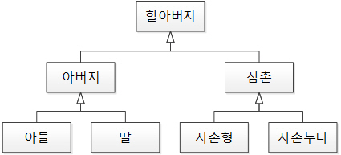
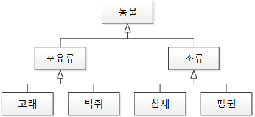
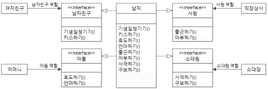
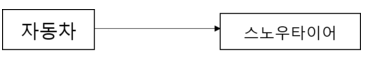
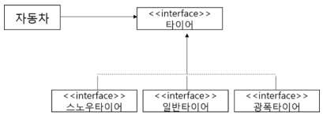

# 객체 지향 개발 5대 원칙: SOLID

> 시간이 지나도 **유지 보수**와 **확장이 쉬운** 시스템을 만들기 위해 지켜야할 원칙들을 정리한 것이다. 2000년대 초에 로버트 마틴이 정리해서 명명했다.

## 1. SRP (Single responsibility principle: 단일 책임의 원칙) 

### 정의

- **한 클래스**는 **하나의 책임**만 가져야 한다.
- SRP 원리를 적용하면 무엇보다도 책임 영역이 확실해지기 떄문에, 한 책임의 변경에서 다른 책임의 변경으로의 연쇄작용에서 자유로울 수 있다
- 책임의 적절히 분배함으로써 **코드의 가독성이 향상되고 유지보수가 용이**해진다.
- OCP원리뿐 아니라 **다른 원리들을 적용하는 기초**
- 실무에서는 프로세스가 매우 복잡 다양하고 변경 또한 빈번하기 때문에 경험이 많지 않으면 SRP원리에서 멀어지기 쉬움

### 적용 방법

- **여러 원인에 의한 변경 (Divergent change)**
  - Extract Class를 통해 혼재된 각 책임을 각각의 개별 클래스로 분할하여 클래스 당 하나의 책임만을 맡도록 한다.
  - 책임만 분리하는 것이 아니라 분리된 두 클래스간의 관계의 복잡도를 줄이도록 설계
  - Extract Class된 각각의 클래스들이 유사하고 비슷한 책임을 중복해서 갖고 있다면 Extract Superclass를 사용할 수 있다.
- **산탄총 수술 (Shotgun surgery)**
  - Move Field와 Move Method를 통해 책임을 기존의 어떤 클래스로 모으거나, 이럴만한 클래스가 없다면 새로운 클래스를 만들어 해결
  - 산발적으로 여러 곳에 분포된 책임들을 한 곳에 모으면서 설계 -> 응집도를 높이는 작업

 

## 2. OCP (Open/closed principle: 개방-폐쇄 원칙)

### 정의

- 스프트웨어의 구성 요소(컴포넌트, 클래스, 모듈, 함수)는 확장에는 열려 있으나 변경에는 닫혀 있어야 한다.
- 요구사항의 변경이나 추가사항이 발생하더라도, 기존 구성요소는 수정이 일어나지 말아야 하며, 기존 구성요소를 쉽게 확장해서 재사용할 수 있어야 한다.
- OCP를 가능케 하는 중요 메커니즘은 추상화와 다형성
- 객체지향의 장점을 극대화하는 아주 중용한 원리

### 적용방법

1. 변경(확장)될 것과 변하지 않을 것을 엄격히 구분한다.

2. 이 두 모듈이 만나는 지점에 인터페이스를 정의한다.
3. 구현에 의존하기보다 정의한 인터페이스에 의존하도록 코드를 작성

- 위에서 운전자가 기어가 수동 or 자동이냐에 따라 행동이 달라지는 것을 볼 수 있다.
- 어떠 변화가 있을 때 바로 운전자에게 영향이 오기에 OCP 원칙 위배

- 상위 클래스 또는 인터페이스를 중간에 둠으로써 다양한 자동차가 생긴다고 해도, 운전자는 운전 습관에 영향을 받지 않게 된다.
- 다양한 자동차가 생긴다는 것은 자동차 입장에서는 자신의 확장에는 개방되어 있는 것이고, 운전자 입장에서는 주변의 변화에 폐쇄되어 있는 것이다.

 

## 3. LSP (Liskov substitution principle: 리스코프 치환 원칙)

### 정의

- 서브 타입은 언제나 기반 타입으로 교체할 수 있어야 한다.

  = 서브 타입은 언제나 기반 타입과 호환될 수 있어야 한다.

  = 서브 타입은 기반 타입이 약속한 규약을 지켜야 한다.

- 하위 클래스의 인스턴스는 상위형 객체 참조 변수에 대입해 상위 클래스의 인스턴스 역할을 하는데 문제가 없어야 한다.

### 적용방법

1. 만약 두 개체가 똑같은 일을 한다면 둘을 하나의 클래스로 표현하고 이들을 구분할 수 있는 필드를 둔다.
2. 똑같은 연산을 제공하지만, 이들을 약간씩 다르게 한다면 공통의 인터페이스를 만들고 둘이 이를 구현한다 (인터페이스 상속)
3. 공통된 연산이 없다면 완전 별개인 2개의 클래스를 만든다.
4. 만약 두 개체가 하는 일에 추가적으로 무언가를 더 한다면 구현 상속을 사용한다.

- 위는 리스코프 치환 원칙을 위배한 경우다.

- 위는 리스코프 치환 원칙을 만족한 경우다.

 

## 4. ISP (Interface segregation principle: 인터페이스 분리 원칙)

### 정의

- 한 클래스는 자신이 사용하지 않는 인터페이스는 구현하지 말아야 한다.
- 어떤 클래스가 다른 클래스에 종속될 때에는 가능한 최소한의 인터페이스만을 사용해야 한다.
- 하나의 일반적인 인터페이스보다는, 여러 개의 구체적인 인터페이스가 낫다
- SRP가 클래스의 단일책임을 강조한다면, ISP는 인터페이스의 단일책임을 강조. 하지만 ISP는 어떤 클래스 혹은 인터페이스가 여러 책임 혹은 역할을 갖는 것을 인정한다. 이러한 경우 ISP가 상용되는데 SRP가 클래스 분리를 통해 변화에 대한 적응성을 획득하는 반면,  ISP에서는 인터페이스 분리를 통해 같은 목표에 도달.

### 적용방법

1. 클래스 인터페이스를 통한 분리
   - 클래스의 상속을 이용하여 인터페이스를 나눌 수 있다.
   - 이와 같은 구조는 클라이언트에게 변화를 주지 않을 뿐 아니라 인터페이스를 분리하는 효과를 갖는다.
2. 객체 인터페이스를 통한 분리
   - 위임(Delegation)을 이용하여 인터페이스를 나눌 수 있다.
   - 위임이란, 특정 일의 책임을 다른 클래스나 메소드에 맡기는 것이다. 만약 다른 클래스의 기능을 사용해야 하지만 그 기능을 변경하고 싶지 않다면, 상속 대신 위임을 사용한다.

- 인터페이스 분리 원칙은 각 역할에 맞게 인터페이스로 분리하는 것(ex 어머니한테는 아들, 여자친구한테는 남자친구)

 

## 5. DIP (Dependency inversion principle: 의존관계 역전 원칙)

### 정의

- 추상화된 것은 구체적인 것에 의존하면 안된다. 구체적인 것이 추상화된 것에 의존해야 한다. 자주 변경되는 구체(Concrete) 클래스에 의존하지 마라.
- 고차원 모듈은 저차원 모듈에 의존하면 안된다. 이 두 모듈 모두 다른 추상화된 것에 의존해야한다.
- DIP의 키워드는 'IOC', '훅 메소드' (슈퍼클래스에서 디폴트 기능을 정의해두거나 비워뒀다가 서브클래스에서 선택적으로 오버라이드할 수 있도록 만들어둔 메소드. 서브클래스에서는 추상 메소드를 구현하거나, 훅 메소드를 오버라이드하는 방법을 이용해 기능의 일부를 확장), '확장성'

- 자동차가 타이어에 의존하면 안된다. 자동차 타이어는 자주 바뀌게 되는 것 중 하나이다.

- 자동차가 구체적인 타이어가 아닌 추상화된 타이어 인터페이스에만 의존하게 함으로써, 타이어가 변경되어도 자동차가 영향을 받지 않느다.

 

### 참고

[SOLID (객체 지향 설계)](https://ko.wikipedia.org/wiki/SOLID_(%EA%B0%9D%EC%B2%B4_%EC%A7%80%ED%96%A5_%EC%84%A4%EA%B3%84))

[객체지향 개발 5대 원리: SOLID](https://www.nextree.co.kr/p6960/)

[[Java] 객체지향 설계 5원칙 - SOLID란 무엇일까?](https://devlog-wjdrbs96.tistory.com/380)

