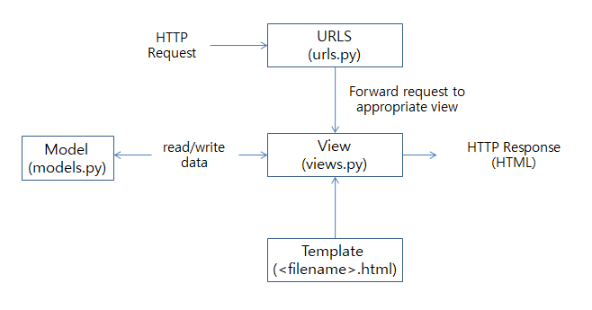

# 00_Django_Intro


## Web Framework

#### Django *

- Django는 high-level Python Web framework
- 빠른 개발과 깔끔하고 실용적인 디자인을 할 수 있음

- 웹개발의 귀찮은 일들을 처리해주기 때문에, 바퀴를 다시 만들지 않고 원하는 앱을 개발하는데 집중할 수 있음
  - DRY: Do not Reapeat Yourself (파이썬, 장고의 정신)

#### Framework

- 프로그래밍에서 특정 운영 체제를 위한 응용 프로그램 표준 구조를 구현하는 클래스와 라이브러리 모임
- 재사용할 수 있는 수많은 코드를 프레임워크로 통합함으로써 개발자가 새로운 애플리케이션을 위한 표준 코드를 다시 작성하지 않아도 같이 사용할 수 있도록 도움
- Application Framework 라고도 함

- 밀키트, 프렌차이즈
  - 정해진 순서대로 따라가면 원하는 결과를 얻을 수 있음

- Framework가 탈것(포크레인)이라면, 라이브러리는 도구(삽)이다. 포크레인을 커스터마이징 하는게 정말 힘들지만 삽은 가능하다.
- 장고는 로봇의 눈과 입을 채우면 동작하지만, 플라스크는 레고처럼 한땀한땀 만들어 나가는 프레임워크.

#### Framework Architecture

- 쉽게 이야기하면 노하우, 방법론

- MVC Design Pattern (model-view-controller)
- 소프트웨어 공학에서 사용되는 디자인 패턴 중 하나
- 사용자 인터페이스로부터 프로그램 로직을 분리하여 애플리케이션의 시각적 요소나 이면에서 실행되는 부분을 서로 영향 없이 쉽게 고칠 수 있는 애플리케이션을 만들 수 있음
- Django 는 MTV Pattern이라고 함 *

> 프로그래밍은 "데이터"가 어떻게 "행동/표현/계산"할지를 만드는 것이다.
>
> MVC에서 데이터가 M이고 V가 보여지는 것이고 C가 어떻게 보여줄지 조절하는 것이다.

#### MTV Pattern

| 약자 |                          M : Model                           |                         T: Template                          |                           V: View                            |
| ---- | :----------------------------------------------------------: | :----------------------------------------------------------: | :----------------------------------------------------------: |
| MVC  |                            Model                             |                             View                             |                          Controller                          |
| 역할 | - 응용 프로그램의 데이터 구조를 정의<br />-ORM을 통해 데이터베이스의 CRUD를 담당한다. | 사용자에게 보여지는 부분으로 쉽게 html 파일이라고 생각하면 된다. | 1. HTTP 요청을 수신하고 HTTP 응답을 반환<br /> 2. Model을 통해 요청에서 필요로 하는 데이터에 접근<br /> 3. template에게 응답의 서식 설정을 맡긴다. |



## Django Intro

> ### Django 시작하기

#### vscode 설정

- Extensions
  - Django
  - Excel Viewer

- 설정

  `ctral+shift+p` -> `json` -> `Preferences: Open Settings(JSON)`

  ```json
  // settings.json
  
  {
    ... 생략 ...,
  
    // Django
    "files.associations": {
      "**/*.html": "html",
  	    "**/templates/**/*.html": "django-html",
      "**/templates/**/*": "django-txt",
      "**/requirements{/**,*}.{txt,in}": "pip-requirements"
    },
    "emmet.includeLanguages": {
      "django-html": "html"
    }
  }
  ```

#### Django 시작

```shell
$ python -m venv venv					# venv폴더에 가상환경 만들기
$ source venv/Script/activate 			# 가상환경 켜기, deactivate는 끄기
$ pip install django					# 가상환경에서 django 설치
$ pip freeze > requiremenst.txt			# pip list 출력하기
$ django-admin startproject crud .		# project 시작하기. "."은 현재 폴더에 시작
$ python manage.py startapp articles	# articles 앱 만들기, application명은 복수형 권장
$ python manage.py runserver			# 서버 테스트하기
```

- 프로젝트 이름 주의 사항
  - Python이나 Django에서 사용 중인 키워드 및 "-"(하이픈) 사용 불가

#### gitignore

- gitignore.io에서 venv, python, django, visualstudiocode, windows로 생성

> ### 프로젝트 구조

#### __init__.py

- Python에게 이 디렉토리를 하나의 Python 패키지로 다루도록 지시

#### asgi.py

- Asynchronous Server Gateway Interface
- django 애플리케이션이 비동기식 웹 서버와 연결 및 소통하는 것을 도움

#### settings.py

- 애플리케이션의 모든 설정

#### urls.py

- 사이트의 url과 적절한 views의 연결을 지정
- 집배원이라고 생각하면 됨

#### wsgi.py

- Web Server Gateway Interface
- django 애플리케이션이 웹서버와 연결 및 소통하는 것을 도움.
- 배포할 때 쓰임

#### manage.py

- Django 프로젝트와 다양한 방법으로 상호작용 하는 커맨드라인 유틸리티


> ### Application 구조

#### admin.py

- 관리자용 페이지를 설정 하는 곳

#### apps.py

- 앱의 정보가 작성된 곳

#### models.py

- 앱에서 사용하는 Model을 정의하는 곳

#### tests.py

- 프로젝트의 테스트 코드를 작성하는 곳

#### views.py

- view 함수들이 정의 되는 곳

#### urls.py

- 사이트의 url과 적절한 views의 연결을 지정
- 어플리케이션의 urls.py는 ***직접***  만들어야함 *


> ### Project & Application

#### Project

- 프로젝트는 앱의 집합
- 프로젝트에는 여러 앱이 포함될 수 있음
- 앱은 여러 프로젝트에 있을 수 있음

#### Application

- 앱은 실제 요청을 처리하고 페이지를 보여주고 하는 등의 역할을 담당
- 일반적으로 앱은 하나의 역할 및 기능 단위로 작성


> ### 앱 등록

- 프로젝트에서 앱을 생성한 후에 사용하려면 **반드시** `setting.py` 에`INSTALLED_APPS`에 추가해야함
- `INSTALLED_APPS`에 저장된 순서대로 앱이 실행된다.
- 아래와 같은 순서로 추가하는 것이 권장됨.``
- 앱 등록시 ***"반드시 생성 후 등록!"***. 미리 등록하면 앱 생성이 안됨.

```python
INSTALLED_APPS = [
    # Local apps
    'articles',
    
    # Third party apps
    'djangorestframework'
    
    # Django apps
    'django.contrib.admin',
    'django.contrib.auth',
    'django.contrib.contenttypes',
    'django.contrib.sessions',
    'django.contrib.messages',
    'django.contrib.staticfiles',
]
```


### URL path converter 

(*잘 봐두라*)


## Django Model


## 시험 팁

1. LANGUAGE_CODE = 'ko-kr'
   TIME_ZONE = 'Asia/Seoul'
2. settings.py에서 앱 순서 중요
3. app urls.py 자동 x

1. settings.py에 신규 앱 articles추가, 언어, 지역 ko-kr, Asia/Seoul 설정  2. MTV(model template view) 정의 및 MVC(model view controller)와의 차이    3. DTL(django template language)

