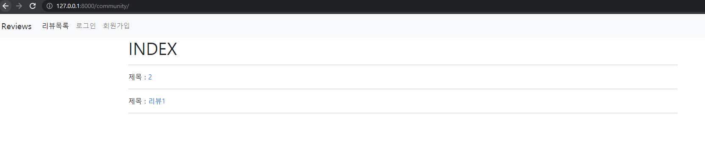
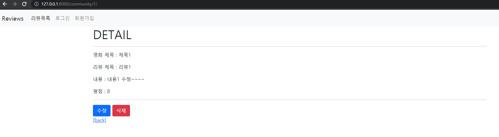
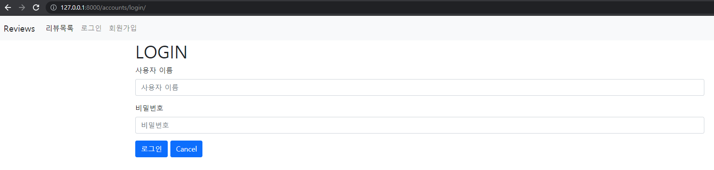
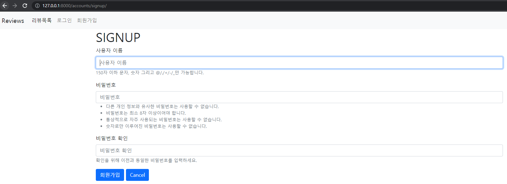
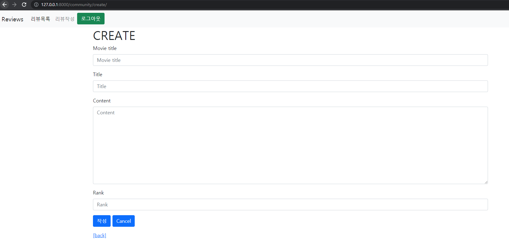
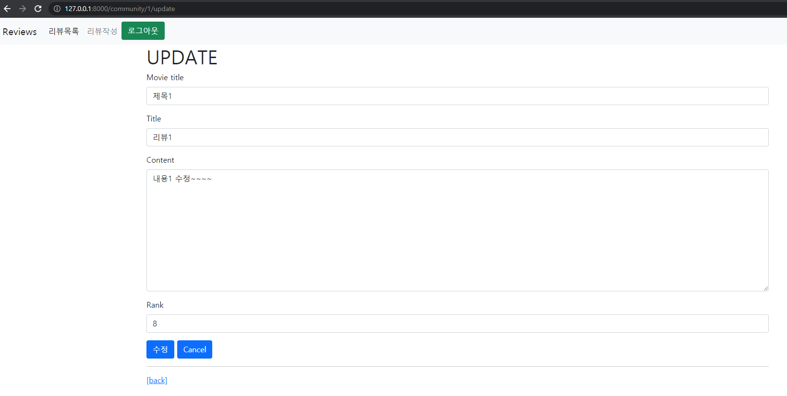

# README

### 0. 개요

django, bootstrap을 이용해서 회원가입 기능이 있는 영화 리뷰 게시판 만들기.


### 1. 사진














### 2. 코드

> #### community/views.py

```python
from django.shortcuts import render, redirect, get_object_or_404
from django.views.decorators.http import require_http_methods, require_POST, require_safe
from django.contrib.auth.decorators import login_required
from .models import Review
from .forms import ReviewForm
# Create your views here.


@login_required
@require_http_methods(['GET', 'POST'])
def create(request):
    if request.method == 'POST':
        form = ReviewForm(data=request.POST)
        if form.is_valid():
            review = form.save()
            return redirect('community:detail', review.pk)
    else:
        form = ReviewForm()
    context = {
        'form': form,
    }
    return render(request, 'community/create.html', context)


@require_safe
def index(request):
    reviews = Review.objects.order_by('-pk')

    context = {
        'reviews': reviews,
    }
    return render(request, 'community/index.html', context)


@require_safe
def detail(request, review_pk):
    review = get_object_or_404(Review, pk=review_pk)
    context = {
        'review': review,
    }
    return render(request, 'community/detail.html', context)


@login_required
@require_http_methods(['GET', 'POST'])
def update(request, review_pk):
    review = get_object_or_404(Review, pk=review_pk)
    if request.method == 'POST':
        form = ReviewForm(request.POST, instance=review)
        if form.is_valid():
            form.save()
            return redirect('community:detail', review.pk)
    else:
        form = ReviewForm(instance=review)
    context = {
        'review': review,
        'form': form,
    }
    return render(request, 'community/update.html', context)


@require_POST
def delete(request, review_pk):
    if request.user.is_authenticated:
        review = get_object_or_404(Review, pk=review_pk)
        review.delete()
    return redirect('community:index')
```


> #### accounts/views.py

```python
from accounts.forms import CustomUserChangeForm
from django.shortcuts import redirect, render
from django.contrib.auth.forms import AuthenticationForm, PasswordChangeForm, UserCreationForm
from django.contrib.auth.models import User
from django.contrib.auth import login as auth_login, update_session_auth_hash
from django.contrib.auth import logout as auth_logout
from django.contrib.auth.decorators import login_required
from django.views.decorators.http import require_POST, require_http_methods, require_safe
# Create your views here.


@require_http_methods(['GET', 'POST'])
def signup(request):
    if request.user.is_authenticated:
        return redirect('accounts:index')

    if request.method == 'POST':
        form = UserCreationForm(request.POST)
        if form.is_valid():
            user = form.save()
            auth_login(request, user)
            return redirect('community:index')
    else:
        form = UserCreationForm()

    context = {
        'form': form,
    }
    return render(request, 'accounts/signup.html', context)


@require_http_methods(['GET', 'POST'])
def login(request):
    if request.user.is_authenticated:
        return redirect('community:index')

    if request.method == 'POST':
        form = AuthenticationForm(request, request.POST)
        if form.is_valid():
            auth_login(request, form.get_user())
            return redirect(request.GET.get('next') or 'community:index')
    else:
        form = AuthenticationForm()

    context = {
        'form': form,
    }

    return render(request, 'accounts/login.html', context)


@require_POST
def logout(request):
    if request.user.is_authenticated:
        auth_logout(request)
    return redirect('community:index')

```


### 3. 소감

- 팀원과 함께 페어프로그래밍으로 진행했다. 이번에는 내가 드라이버 역할을 맡아서 진행했다. 
- 다른 부분들은 지난번 movie 프로젝트와 비슷했지만 회원가입 및 로그인 기능을 구현할 때 django authentication 내용이 추가되었다.
- decorator를 2개 이상 사용할 때, 순서가 중요하다는 것을 다시 한번 숙지했다.
- `@login_required ` 를 사용했을 때 돌아올 url이 `next`키워드의 값으로 들어간다. 이를 `accounts/views.py`의 `login `함수에서 처리하는 방법이 흥미로웠다.

