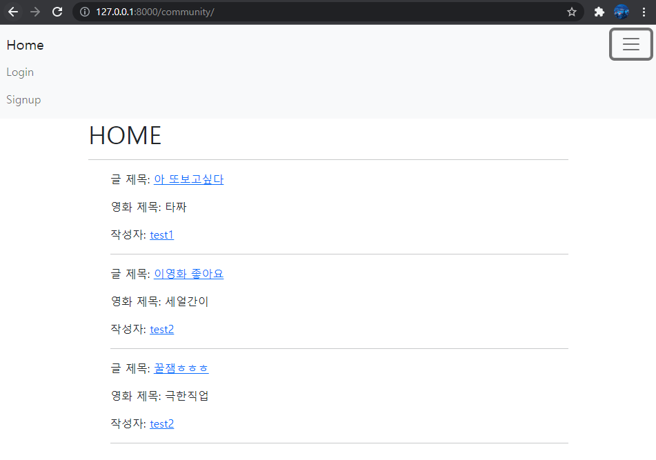
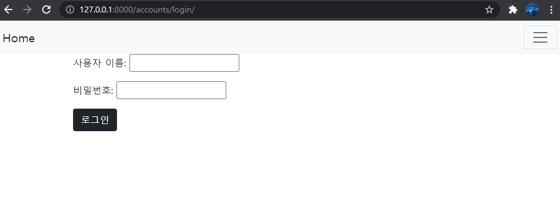
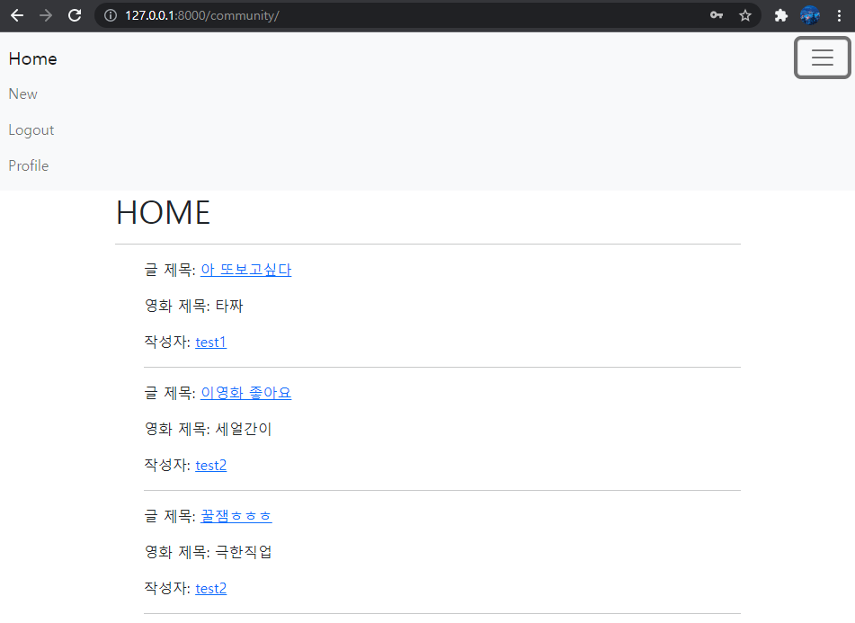
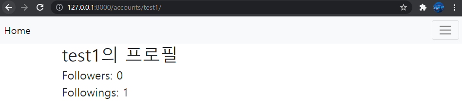
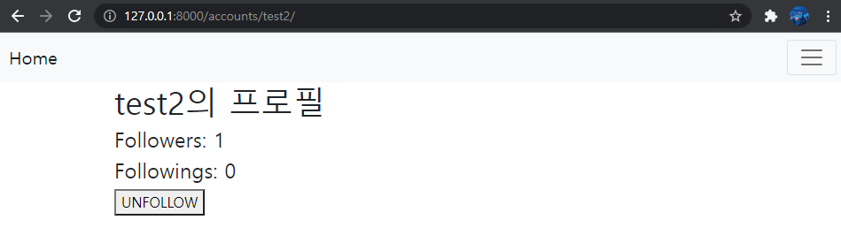
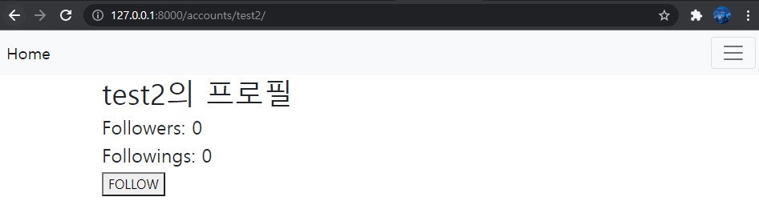
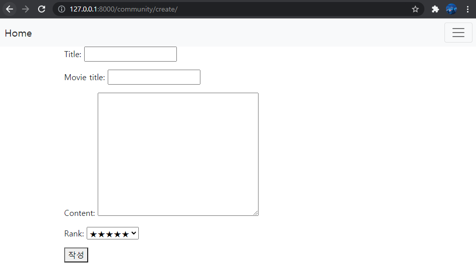
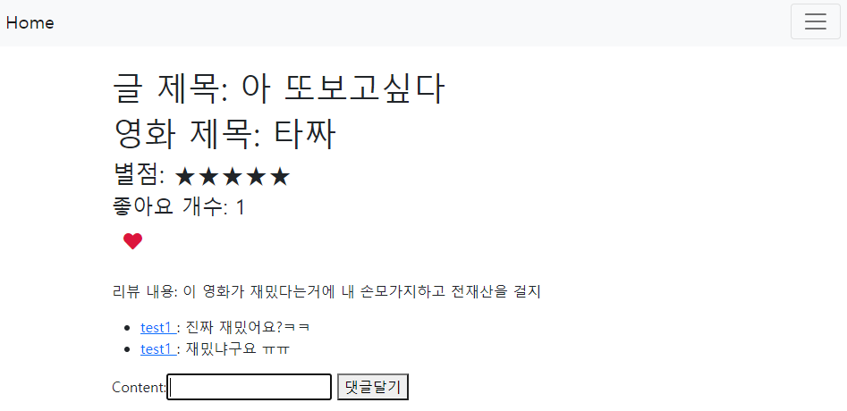
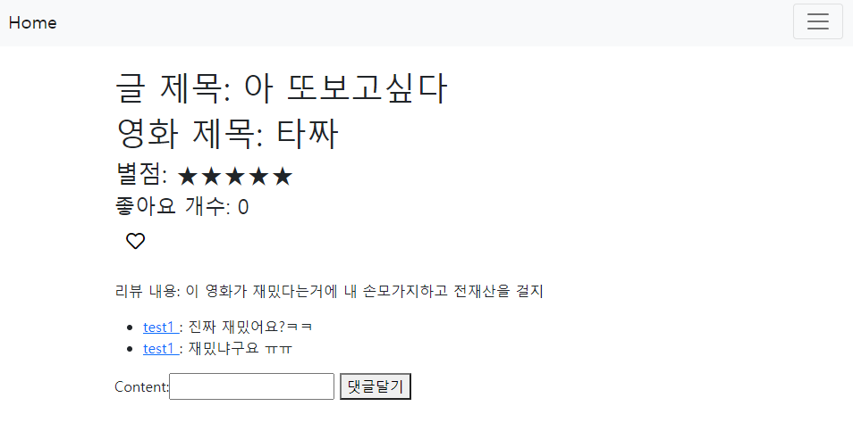

# README

> ### 소개

django, bootstrap을 이용해서 좋아요, 팔로우,댓글 기능이 있는 영화 리뷰 게시판 만들기

> ### 사진

**메인**

**회원가입**

**로그인**

**로그인된 화면**

**프로필(본인 프로필)**

**프로필(타인 프로필-팔로우 구현)**

**리뷰 작성**

**상세페이지(좋아요 구현)**

> ### 구현 과정

1. 먼저 프로젝트를 만들고, accounts, community 앱을 만들고 settings.py에 등록
2. auth.User를 그대로 사용하지 않고 커스텀 할 것이기에 settings.py에서 `AUTH_USER_MODEL = 'accounts.User'`등록
3. settings.py에서 TEMPLATES, LANGUAGE_CODE, TIME_ZONE 수정
4. 먼저 Model을 작성. accounts앱에서 User클래스, community앱에서 Review, Comment클래스를 통해 DB설계를 구현
5. 다음 url을 설정
6. 각 url에서 사용하는 view함수에 맞추어 view를 설정.
   - 이 때 모델폼을 사용하였는데, accounts앱에서는 CustomUserCreationForm, community앱에서는 ReviewForm과 CommentForm을 커스텀해서 사용.
7. 각 view에 해당하는 template파일을 생성
