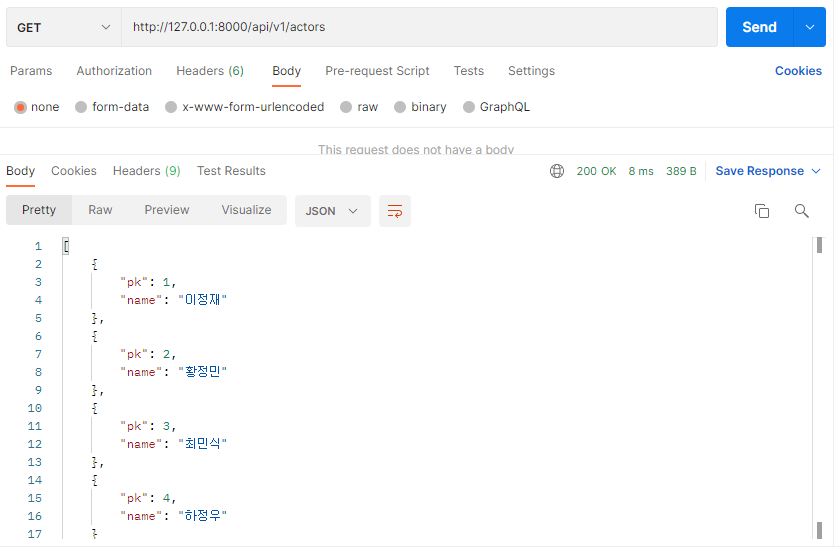
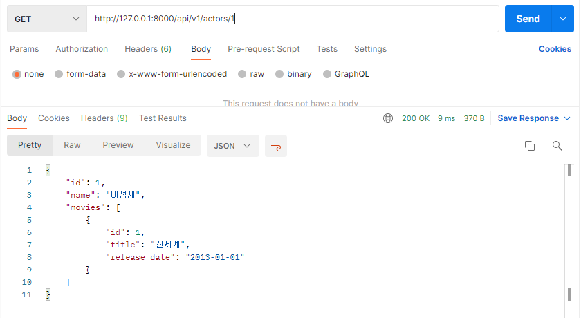
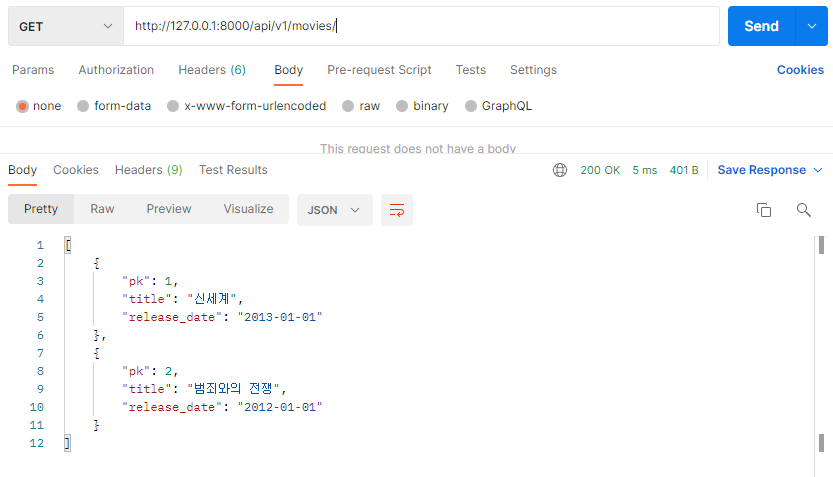
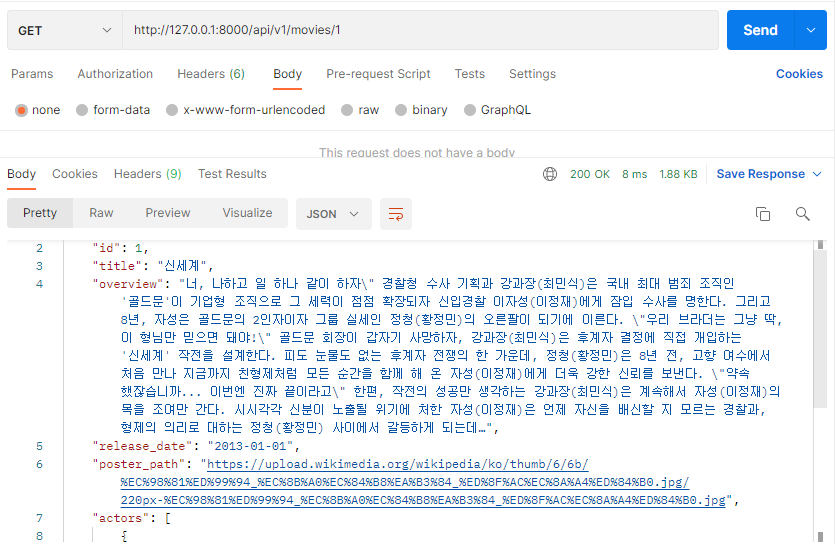
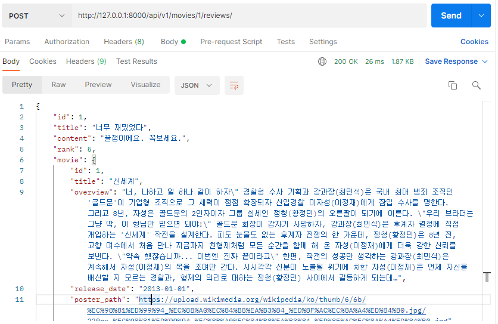
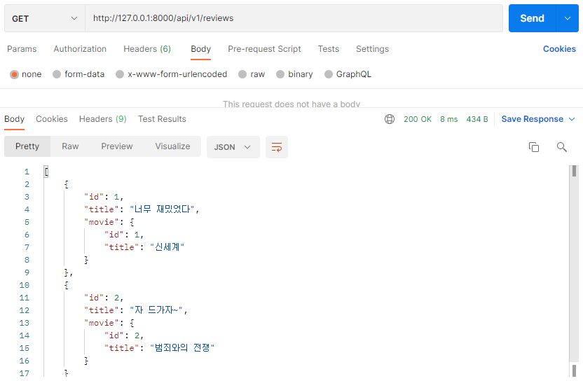
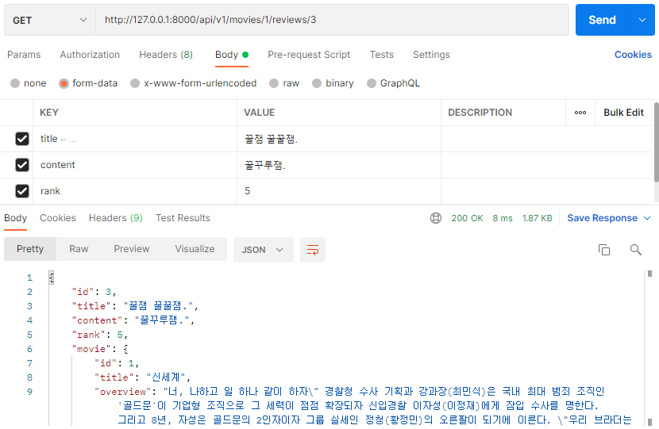
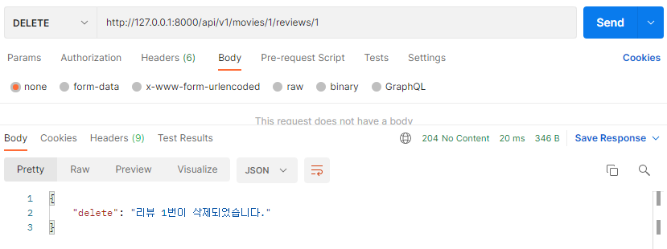
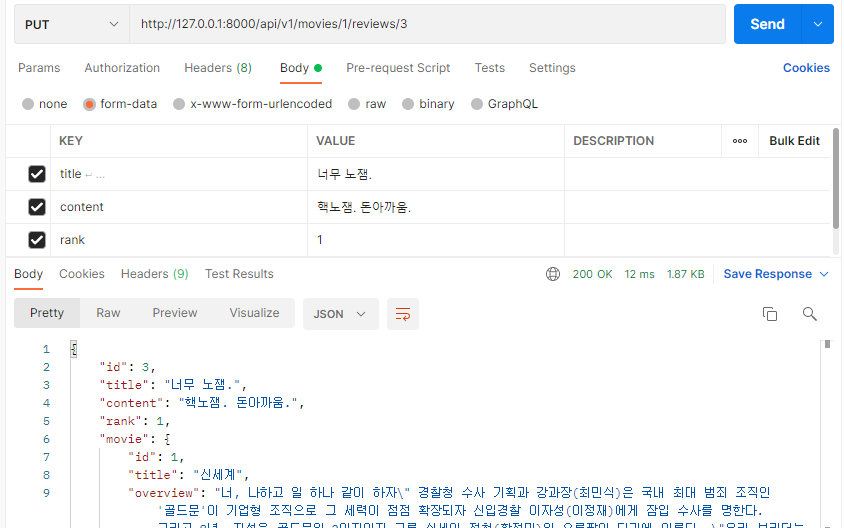
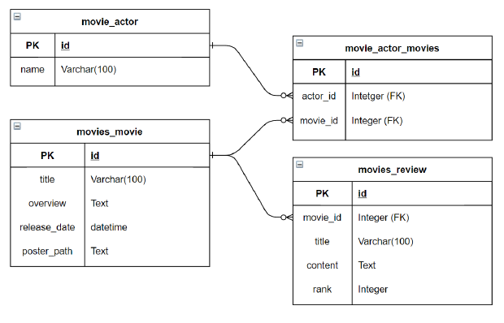

# README

> ### 프로젝트 개요

Django, DRF(Django Rest Framework)를 사용하여 배우, 영화, 리뷰 정보와 관련된 Rest API 설계해 보기

> ### 결과 사진

**전체 배우 목록**

**단일 배우 정보**

**전체 영화 목록**

**단일 영화 정보**

**리뷰 생성**

**전체 리뷰 목록**

**단일 리뷰 정보**

**리뷰 삭제**

**리뷰 수정**

> ### 구현 과정

0. 패키지 설치
   - `django, djangorestframework` 패키지를 설치

1. 프로젝트와 앱 생성
   - `pjt08`이라는 이름으로 project를 생성
   - `movies`라는 앱을 생성
   - `movies`앱과 `rest_framework ` 패키지를 settings.py에 등록

2. movies/models.py에 Model 생성

   

   - 위의 ERD에 맞추어 Model을 만들었음

3. URL 생성

   - 전체 배우 목록 조회(GET)
   - 단일 배우 정보 조회(GET)
   - 전체 영화 목록 조회(GET)
   - 단일 영화 정보 조회(GET)
   - 리뷰 생성(GET)
   - 전체 리뷰 목록 조회(GET)
   - 단일 리뷰 정보 조회(GET), 수정(PUT), 삭제(DELETE) 

   에 해당하는 URL을 생성

4. movies/serializers.py 작성

5. movies/views.py 작성

6. movies/admin.py 에 Model 등록 후 supueruser 만들기

> ### 소감

이번주 처음으로 DRF를 다뤄보았는데 쉽지 않았다. 부분 부분 이해하고 만들 때는 괜찮았는데 다시 처음부터 내가 만드려고 하면 턱턱 막혔다. 5일만에 다 이해하기는 욕심일것 같다. 앞으로 개인적으로 다른 프로젝트도 진행해 보면서 이해도를 높여야 할 것 같다. 특히나, serializer를 구현하는 부분에서 Class안에 inner Class를 설정하여 사용하는 부분이 아직 와닿지 않는다. 후에 시간이 남는다면 DRF 패키지가 어떻게 구현되어 있는지 github에서 한번 뜯어봐도 좋을것 같다. 

또, serializer를 만드는 과정에서 아직 M:N 관계일 때 create메서드와 update 메서드를 override 하는 부분이 있었는데 이번 프로젝트에서는 구현해보지 못했다. 추후에 개인적인 공부나 프로젝트를 진행할 때 같이 구현해보면 좋을것 같다. 그리고 마지막으로 DB에서 ORM으로 데이터를 불러올 때 SQL 쿼리문을 적게 생성하도록 하는 최적화하는 것도 사용해보면 좋을것 같다.

그래도 기존에는 Open API에서 데이터를 받아보기만 했었는데 이번에는 내가 API 서버를 로컬에서라도 구현해 봐서 뿌듯했다. 나중에 API 서버까지 제대로 만들어서 구현하면 좋을것 같다.

