# Vue CLI 프로젝트 기반 DevOps 개발환경 실습 - 김현규

#### <목차>

[개요](#개요)

[Vue 프로젝트 생성 및 로컬 실행](#Vue 프로젝트 생성 및 로컬 실행)

[GitHub에 코드 push 및 Pages에 수동 배포](#GitHub에 코드 push 및 Pages에 수동 배포)

[GitHub Actions workflow로 배포 자동화](#GitHub Actions workflow로 배포 자동화)

[테스트 실패로 인해 자동으로 배포가 되지 않는 것을 확인하기](#테스트 실패로 인해 자동으로 배포가 되지 않는 것을 확인하기)


## :scroll:개요

### 과제 소개 

- 배포(Deploy)하기
  - Vue Project를 수작업으로 빌드하고, GitHub Pages라는 서비스에 호스팅
- 배포 자동화 하기
  - GitHub Actions에서 워크 플로우를 구성하여 커밋 & 푸시 만으로 배포 자동화하기

> 나중에 프로젝트 프론트 부분을 간단하게 배포하거나, GitHub Pages를 사용한 블로그 운영을 하고 싶을 때도 도움될 것.

<br/>

<br/>

## :point_right:Vue 프로젝트 생성 및 로컬 실행

#### 1. 사전 환경 구성

**yarn 설치([관련 사이트](https://classic.yarnpkg.com/en/docs/install#windows-stable))**

```shell
$ npm install --global yarn
```

>yarn: npm의 한계(패키지 설치속도, 보안 등)를 극복하기 위해 나온 패키지 매니저

shell에서 다음 명령어로 **Vue CLI를 설치**(기존 Vue 프로젝트 했어서 이미 되어 있음)

```shell
$ yarn global add @vue/cli
$ vue -V
```

#### 2. Vue 프로젝트 생성

```shell
$ vue create vue-devops
```

- Manual select features, Unit Testing 추가 선택, 3.x, ESLint + Prettier, Lint on save, Jest, In dedicated config files, N

#### 3. 로컬에 실행

```shell
$ cd vue-devops
$ yarn serve
```

<br/>

<br/>

## :snail:GitHub에 코드 push 및 Pages에 수동 배포

#### 1. GitHub에 vue-devops 레포지토리 생성

#### 2. 원격 저장소 설정 및 코드 푸시

#### 3. Gihub Pages로 배포하기 위한 라이브러리 추가, package.json 수정

```shell
$ yarn add gh-pages -D
```

```json
  "name": "vue-devops",
  "version": "0.1.0",
  "private": true,
  "homepage": "https://HQkim.github.io/vue-devops",
  "scripts": {
    "serve": "vue-cli-service serve",
    "build": "vue-cli-service build",
    "predeploy": "vue-cli-service build",
    "deploy":"gh-pages -d dist",
    "clean":"gh-pages-clean",
    "test:unit": "vue-cli-service test:unit",
    "lint": "vue-cli-service lint"
  },
```

- homepage, scripts > predeploy, deploy, clean 추가
  - `pre`같 붙으면 그 스크립트를 먼저 실행 -> `yarn deploy`를 실행하면 `yarn predeploy`가 먼저 실행되고 `yarn deploy`가 실행

#### 4. 배포용 publicPath 설정

- 이 설정이 있어야 https://<github_id>.github.io**/vue-devops**에서 정상적으로 페이지 확인 가능

- **프로젝트 최상단**에 vue.config.js 파일을 생성하여 publicPath에 생성한 repository 이름으로 설정

```
module.exports = {
  publicPath: "/vue-devops/",
  outputDir: "dist"
}
```

- 만약 vue-devops대신 <github_id>.github.io 이름으로 Github pages 대표 repository를 만들게 되면 이 설정은 필요 없고 접속할 주소도 https://<github_id>.github.io로 sub path 없이 가능 [참고](https://velog.io/@byungjur_96/vue.js-Github-Pages%EB%A1%9C-%EB%B0%B0%ED%8F%AC%ED%95%98%EA%B8%B0/)
- 여기서는 이미 다른 용도로 사용중인 경우를 고려하여 별도 하위 publicPath를 사용

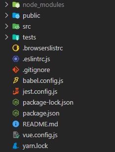

#### 5. `yarn deploy` 명령을 실행하면 빌드 된 정적 파일을 원격 저장소의 gh-pages 브랜치를 생성해서 푸시됨

```shell
$ yarn deploy
```

- 만약 로그인을 실패해서 재시도 할 때 아래와 같은 에러가 발생하면 yarn clean 후 재시도

  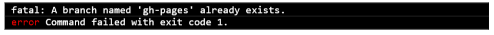

#### 6. https://<github_id>.github.io/vue-devops 에 들어가서 페이지 구동 확인

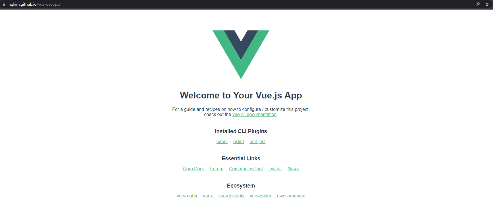

<br/>

<br/>

## :computer:GitHub Actions workflow로 배포 자동화

- GitHub Actions는 GitHub의 소프트웨어개발 워크플로에서 **작업을 자동화**하기 위한 패키지 스크립트

- 새 소스 코드를 `Push`하거나 `Pull Request` 같은 이벤트에 반응하여 트리거하도록 GitHub Actions를 구성 가능

- 여기서 Vue로 작성된 소스 코드를 자동으로 테스트한 다음 빌드하여 GitHub Pages에 배포하는 작업을 자동화함

#### 1. GitHub Actions 메뉴에서 새로운 Workflow 생성

-  **New workflow** 버튼 클릭

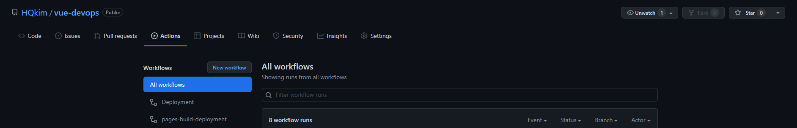

- **set up a workflow yourself**을 눌러서 가장 기본적인 workflow 파일(Deployment.yml)을 작성한 다음 커밋

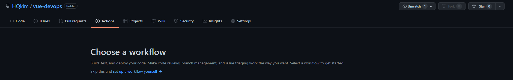

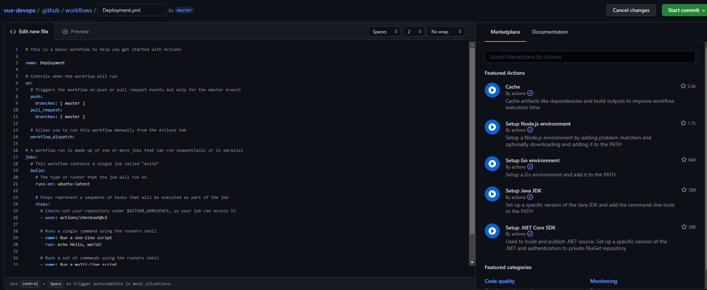

```yml
# This is a basic workflow to help you get started with Actions

name: Deployment

# Controls when the workflow will run
on:
  # Triggers the workflow on push or pull request events but only for the master branch
  push:
    branches: [ master ]
  pull_request:
    branches: [ master ]

  # Allows you to run this workflow manually from the Actions tab
  workflow_dispatch:

# A workflow run is made up of one or more jobs that can run sequentially or in parallel
jobs:
  # This workflow contains a single job called "build"
  build:
    # The type of runner that the job will run on
    runs-on: ubuntu-latest

    # Steps represent a sequence of tasks that will be executed as part of the job
    steps:
      # Checks-out your repository under $GITHUB_WORKSPACE, so your job can access it
      - uses: actions/checkout@v2

      # Runs a single command using the runners shell
      - name: Run a one-line script
        run: echo Hello, world!

      # Runs a set of commands using the runners shell
      - name: Run a multi-line script
        run: |
          echo Add other actions to build,
          echo test, and deploy your project.
```

#### 2. 커밋과 동시에 샘플 workflow가 동작됨을 확인

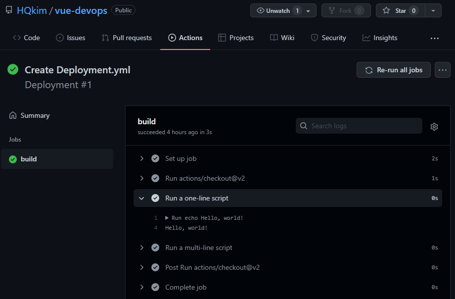

#### 3. git pull을 해서 Deployment.yml을 내려받고. App.vue 파일의 props 데이터인 msg에 본인의 이름을 넣기

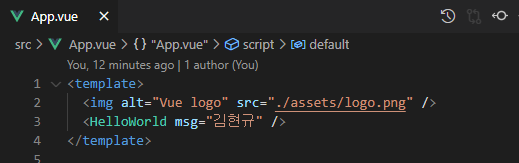

#### 4. 배포 스크립트인 workflow 파일(Deployment.yml) 내용을 다음과 같이 수정

```yml
# This is a basic workflow to help you get started with Actions

name: Deployment

# Controls when the workflow will run
on:
  # Triggers the workflow on push or pull request events but only for the main branch
  push:
    branches: [master]
  pull_request:
    branches: [master]

  # Allows you to run this workflow manually from the Actions tab
  workflow_dispatch:

jobs:
  deploy:
    runs-on: ubuntu-latest

    steps:
      - name: Checkout source code
        uses: actions/checkout@master

      - name: Set up Node.js
        uses: actions/setup-node@master
        with:
          node-version: 14.x

      - name: Install dependencies
        run: yarn install

      - name: Build page
        run: yarn build
        env:
          NODE_ENV: production

      - name: Deploy to gh-pages
        uses: peaceiris/actions-gh-pages@v3
        with:
          github_token: ${{ secrets.GITHUB_TOKEN }}
          publish_dir: ./dist
```

#### 5. 커밋 푸쉬하여 Workflow 동작 결과와 자동 배포된 사이트 내용을 확인


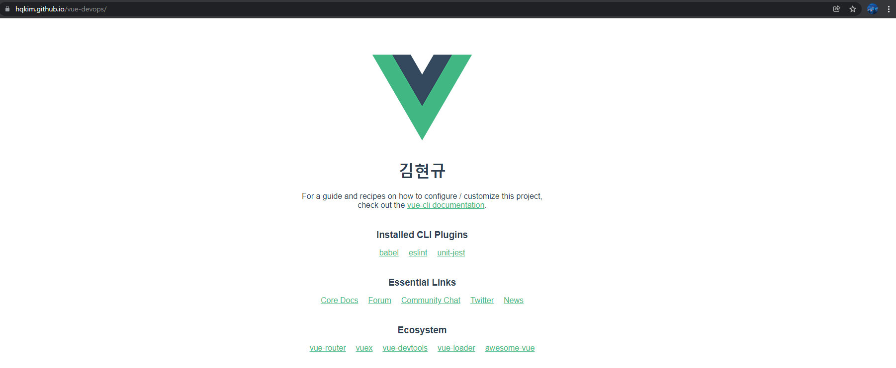

<br/>

<br/>

## :heavy_check_mark:테스트 실패로 인해 자동으로 배포가 되지 않는 것을 확인하기

테스트를 집어넣어 빌드상의 오류 등이 발생했을 때 배포되지 않도록 하기.

#### 1.Workflow파일(Deployment.yml)에서 yarn install, build사이에 다음의 내용을 추가하기

```yml
# This is a basic workflow to help you get started with Actions

name: Deployment

# Controls when the workflow will run
on:
  # Triggers the workflow on push or pull request events but only for the main branch
  push:
    branches: [master]
  pull_request:
    branches: [master]

  # Allows you to run this workflow manually from the Actions tab
  workflow_dispatch:

jobs:
  deploy:
    runs-on: ubuntu-latest

    steps:
      - name: Checkout source code
        uses: actions/checkout@master

      - name: Set up Node.js
        uses: actions/setup-node@master
        with:
          node-version: 14.x

      - name: Install dependencies
        run: yarn install

      - name: Test unit
        run: yarn test:unit

      - name: Build page
        run: yarn build
        env:
          NODE_ENV: production

      - name: Deploy to gh-pages
        uses: peaceiris/actions-gh-pages@v3
        with:
          github_token: ${{ secrets.GITHUB_TOKEN }}
          publish_dir: ./dist
```

#### 2. 테스트가 실패하게 하기

HelloWorld.vue에서 {{ msg }} 부분을 일반 텍스트로 바꿔서 props data를 사용하지 않도록 하면 에러가 난다.

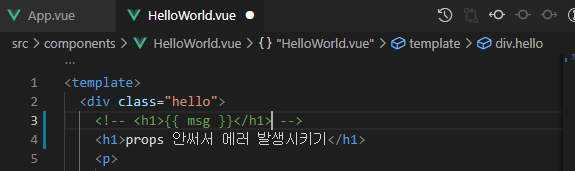

이를 푸시해서 GitHub Actions에서 확인하면 아래와 같다.

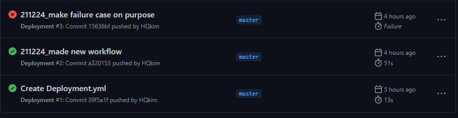


