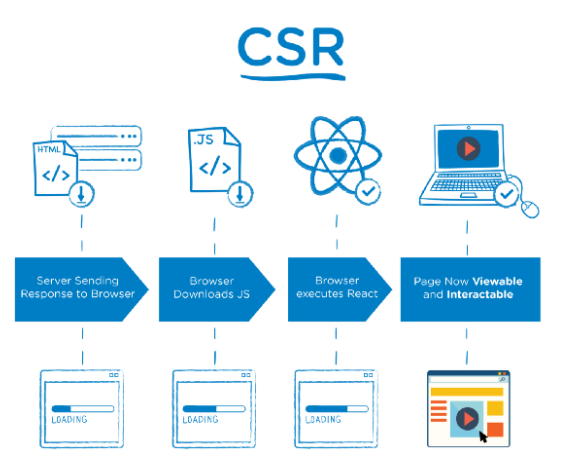
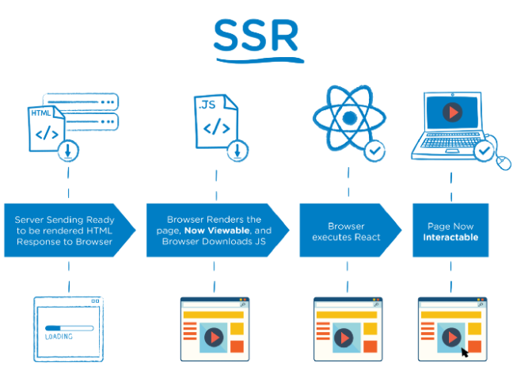
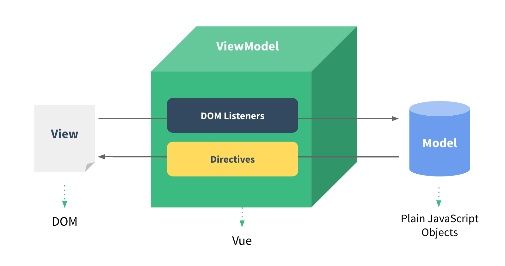
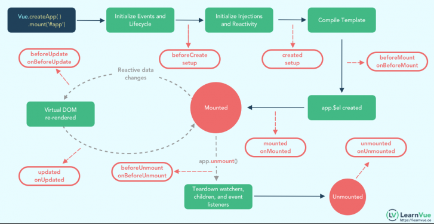

# 00_Vue.js_기초

> ## Intro

#### Front-End Develoment

- HTML, CSS 그리고 JavaScript를 활용해서 데이터를 볼 수 있게 만들어줌!
- 이를 통해 사용자는 데이터를 눈으로 볼 수 있고, 데이터와 상호작용 할 수 있음
- 대표적인 프론트엔드 프레임워크 : Vue.js, React, Angular

#### Vue.js

- 사용자 인터페이스를 만들기 위한 진보적인 자바스크립트 프레임워크 (창시자 피셜)
- 현대적인 tool과 다양한 라이브러리를 통해 SPA(Single Page Application)를 완벽히 지원

- [참고] Evan You에 의해 발표. 구글 Angular보다 더 가볍고, 간편하게 사용할 수 있는 프레임워크를 만들기 위해 개발

#### SPA

Single Page Application(단일 페이지 애플리케이션)

- 현재 페이지를 동적으로 렌더링함으로서 사용자와 소통하는 웹 어플리케이션
- 단일 페이지로 구성되며 서버로부터 최초에만 페이지를 다운로드하고, 이후에는 동적으로 DOM 구성
  - 현재 페이지 중 필요한 부분만 동적으로 다시 생성
- 연속되는 페이지 간의 사용자 경험(UX) 향상!

- 동작 원리의 일부가 CSR의 구조를 따름

#### CSR

Client Side Rendering

​																																			

- 서버에서 화면을 구성하는 SSR 방식과 달리 클라이언트에서 화면을 구성
- 최초 요청 시 HTML, CSS,  JS 등 데이터를 제외한 각종 리소스를 응답받고 이후 클라이언트에서는 필요한 데이터만 요청해 JS로 DOM을 렌더링하는 방식
- 즉, 처음 뼈대만 받고 브라우저에서 동적으로 DOM을 그림
- SPA가 사용하는 렌더링 방식
- 장점
  1. 서버와 클라이언트 간 트래픽 감소
  2. 사용자 경험(UX 향상) 
- 단점
  1. SSR에 비해 전체 페이지 렌더링 시점이 느림
  2. SEO(검색 엔진 최적화)에 어려움이 있음 (최초 문서에 데이터가 없기 때문)

#### SSR

Server Side Rendering

​																																					[사진 출처](https://medium.com/walmartglobaltech/the-benefits-of-server-side-rendering-over-client-side-rendering-5d07ff2cefe8)

- 서버에서 클라이언트에게 보여줄 페이지를 모두 구성하여 전달하는 방식
- JS 웹 프레임워크 이전에 사용되던 전통적인 렌더링 방식
- 장점
  1. 초기 구동 속도가 빠름 : 클라인트가 빠르게 컨텐츠를 볼 수 있음
  2. SEO에 적합 : DOM에 이미 모든 데이터가 작성되어있기 때문
- 단점
  - 모든 요청마다 새로운 페이지를 구성하여 전달
    - 반복되는 전체 새로고침으로 인해 사용자 경험이 떨어짐
    - 상대적으로 트래픽이 많아 서버의 부담이 클 수 있음

#### [참고]SEO

Search Engine Optimization (검색 엔진 최적화)

- 웹 페이지 검색엔진이 자료를 수집하고 순위를 매기는 방식에 맞게 웹 페이지를 구성해서 검색 결과의 상위에 노출될 수 있도록 하는 작업
- 구글의 등장 이후 검색엔진들이 컨텐츠의 신뢰도를 파악하는 기초 지표로 사용됨
  - 다른 웹 사이트에서 얼마나 인용되었나를 반영
  - 결국 타 사이트에 인용되는 횟수를 늘리는 방향으로 최적화

- Vue.js나 React등의 SPA 프레임워크는 SSR을 지원하는 SEO 대응 기술이 이미 존재
  - SEO 대응이 필요한 페이지에 대해서는 선별적 SEO 대응 가능
  - 추가로 별도의 프레임워크를 사용하기도함
    - Nuxt.js - Vue.js응용 프로그램을 만들기 위한 프레임워크, SSR 지원
    - Next.js - React                                        "                                               
    
    

> ## Vue.js 기본

#### Why Vue.js(or React etc)?

- Vanilla JS

  - 한 유저가 100만 개의 게시글을 작성해다고 가정
  - 이 유저가 닉네임을 변경하면, 게시글 100만개의 작성자 이름이 모두 수정되어야 함
  - '모든 요소'를 선택해서 '이벤트'를 등록하고 값을 변경해야함

- Vue.js

  - DOM과 Data가 연결되어 있으면
  - Data를 변경하면 이에 연결된 DOM은 알아서 변경
  - 즉, 우리가 신경 써야할 것은 오직 **Data에 대한 관리**

  

#### MVVM Pattern

- 애플리케이션 로직을 UI로부터 분리하기 위해 설계된 디자인 패턴
- 구성요소: **M**odel, **V**iew, **V**iew **M**odel

#### MVVM Pattern in Vue.js

​																																						[사진 출처](https://012.vuejs.org/images/mvvm.png)

- Model
  - "Vue에서 Model은 Javascript Object다."
  - Object는 Vue Instance 내부에서 data로 사용되는데, 이 값이 바뀌면 View(DOM)가 반응
- View
  - "Vue에서 View는 DOM(HTML)이다."
  - Data의 변화에 따라서 바뀌는 대상
- ViewModel
  - "Vue에서 ViewModel은 모든 Vue Instance이다."
  - VIew와 Model 사이에서 Data와 DOM에 관련된 모든 일을 처리
  - ViewModel을 활용해 Data를 얼마만큼 잘 처리해서 보여줄 것인지(DOM)를 고민하는 것
  
  

> ## Vue.js Quick Start

공식문서([여기](https://kr.vuejs.org/v2/guide/))에 잘 정리되어 있으니 참고하면 좋다! 

> ## Basic syntax

#### Vue instance

- 모든 Vue앱은 Vue함수로 새 인스턴스를 만드는 것부터 시작
- Vue 인스턴스를 생성할 때는 Options 객체를 전달해야 함
- 여러 Options들을 사용하여 원하는 동작을 구현
- Vue Instance === Vue Component

#### Options/Data - 'data'

- Vue 인스턴스의 데이터 객체
- Vue 인스턴스의 상태 데이터를 정의하는 곳
- Vue template에서 interpolation을 통해 접근 가능
- v-bind, v-on과 같은 directive에서도 사용가능
- Vue 객체 내 다른 함수에서 this 키워드를 통해 접근 가능

#### Options/Data - 'methods'

- Vue 인스턴스에 추가할 메서드
- Vue template에서 interpolation을 통해 접근 가능
- v-on과 같은 directive에서도 사용 가능
- Vue 객체 내 다른 함수에서 this 키워드를 통해 접근 가능
- 주의
  - 화살표 함수(Arrow Function)을 메서드를 정의하는데 사용 X
  - 화살표 함수는 부모 컨텍스트를 바인딩해버림 

> ## Template Syntax

#### Template Syntax

- 렌더링 된 DOM을 기본 Vue 인스턴스의 데이터에 선언적으로 바인딩할 수 있는 HTML 기반 템플릿 구문

1. Interpolations
2. Directive

#### Interpolation

1. Text

   `메시지: {{ message }}`

2. Raw HTML -> **XSS 공격에 취약하므로 사용 주의!!**

   ``

3. Attributes

   `

`

4. JS 표현식

   `{{ number + 1 }}`

   `{{ message.split('').reverse().join('') }}`

#### Directive

- v-접두사가 있는 특수 속성
- 속성 값은 단일 JS 표현식이 됨(v-for는 예외)
- 표현식의 값이 변경될 때 반응적으로 DOM에 적용하는 역할을 함

- 전달인자 (Argument)
  - `:`(콜론)을 통해 전달 인자를 받을 수도 있음
- 수식어 (Modifiers)
  - `.`(점)으로 표시되는 특수 접미사
  - directive를 특별한 방법으로 바인딩 해야 함을 나타냄

**자세한 문법은 01_vuejs_basic_practice 폴더나 공식문서 참고!**

> ## Lifecycle Hooks

​																																								[사진 출처](https://learnvue.co/2020/12/how-to-use-lifecycle-hooks-in-vue3/)

- 위와 같이 Vue 인스턴스는 생성될 때 일련의 초기화 단계를 거침
- 그 과정에서 사용자 정의 로직을 실행할 수 있는 Lifecycle Hooks도 호출됨
- [공식 문서](https://v3.ko.vuejs.org/api/options-lifecycle-hooks.html)

- 예전에 안드로이드를 공부했을 때 Activity Lifecycle과 유사한 면이 있는것 같다! (맞나?)

> ### 추가 자료

#### lodash library

- 모듈성, 성능 및 추가 기능을 제공하는 JavaScript 유틸리티 라이브러리
- array, object등 자료구조를 다룰 때 사용하는 유용하고 간편한 유틸리티 함수들을 제공
- [공식 홈페이지](https://lodash.com/)

#### Vue.js의 아버지

[링크](https://blog.naver.com/PostView.nhn?isHttpsRedirect=true&blogId=fastcampus&logNo=220969253285)

#### Vue.js와다른 프레임워크 비교

[링크](https://kr.vuejs.org/v2/guide/comparison.html)

#### 