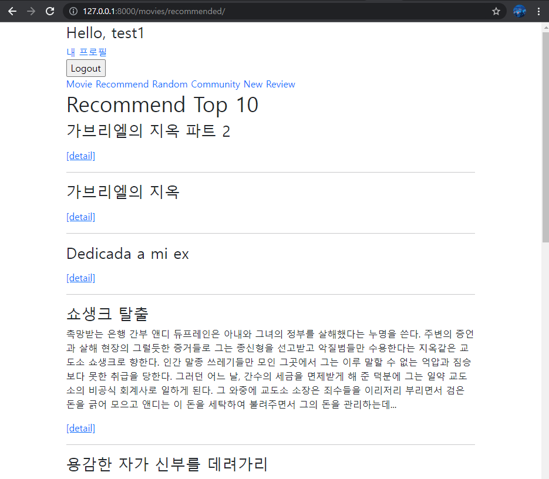
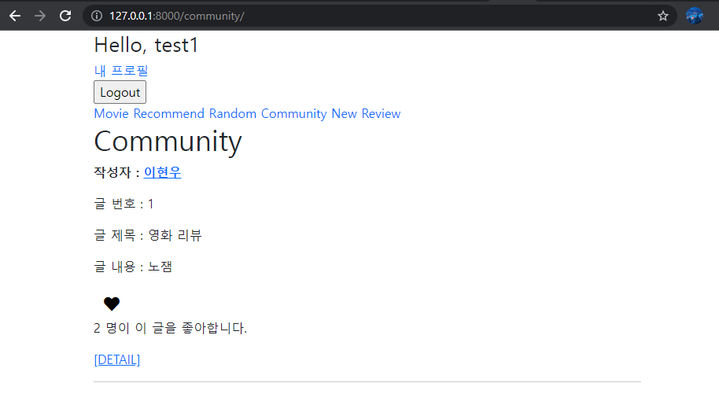
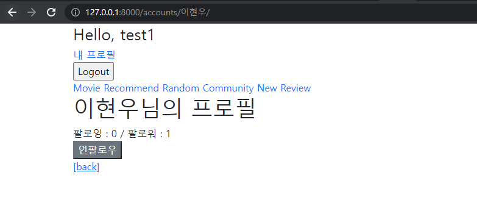
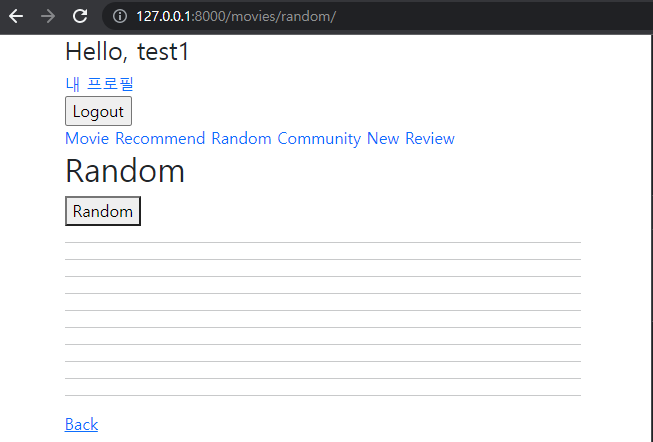
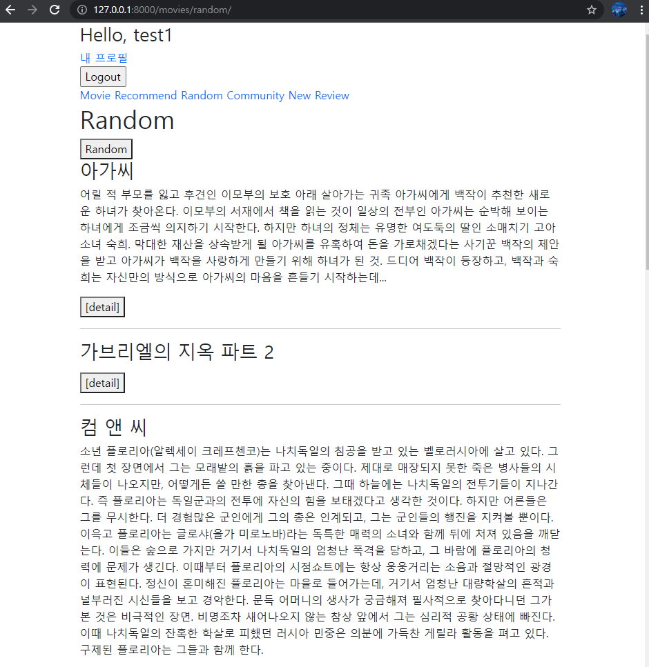

# README

> ### 소개

1. 영화 및 리뷰 데이터의 CRUD를 할 수 있는 Web Application 제작
2. AJAX통신과 JSON 구조
3. Database 1:N, M:N 관계
4. 영화 추천 알고리즘(TOP 10, Random)
5. Django, Javascript, Vue.js, Lodash 이용


> ### 구현 사진

#### 영화 전체 목록


#### Top 10



#### 좋아요




#### 팔로우




> ### 구현 과정

1. 랜덤하게 영화 추천하기

   추가적으로 영화 목록 중에서 10개를 랜덤으로 보여주고 싶었다. 사실 장고 단에서 뽑아서 한번만 보여줬으면 쉽게 구현했을것 같은데, 이를 Vue.js와 Lodash를 활용해서 동적으로 보여주고 싶었다. 그런데 데이터는 잘 가져오는것 같은데 이를 화면상에 띄우려고 하니 빈 내용만 자꾸 렌더링됐다. 원인을 파악하려고 2시간 넘게 투자했지만 해결되지 않았다. 

   **(에러)**

   

   **(해결)**

   

   

   ```javascript
   const app = new Vue ({
               delimiters: ["[[", "]]"],
               el: '#app',
               data: {
                   test: "test",
                   movies: [],
                   randomMovies: [],
               })
   ```

   위와 같이 delimiters를 이용해 변수를 가져오는 표현법을 바뀌니 됐다. 이유는 장고의 template 언어인 {{ }}와 겹쳤기 때문에 충돌이 일어난 것이라고 한다. 이제 random버튼을 누르면 페이지 새로고침 없이 동적으로 영화 10개 랜덤 선택되어 나타난다!!
