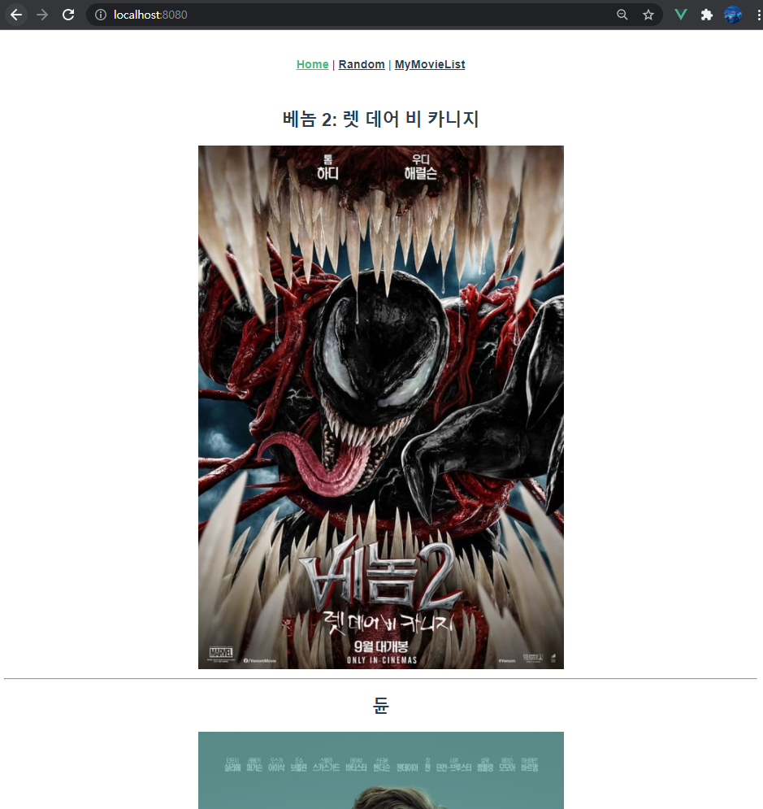
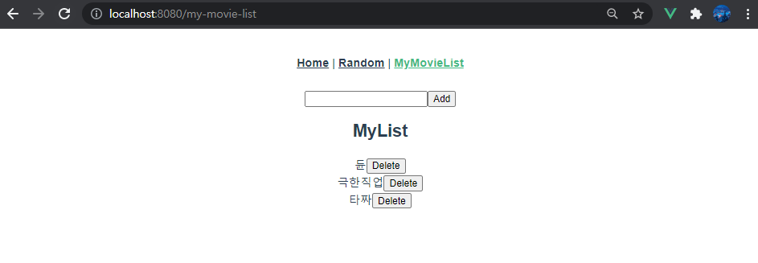

# pjt10

> ### 개요

- Vue, vuex, vue router, tmdb API를 활용하여 영화 리스트 사이트 만들기


> ### 결과 사진







> ###  코드

#### src/store/index.js

```javascript
import Vue from 'vue'
import Vuex from 'vuex'
import axios from 'axios'

const API_KEY = process.env.VUE_APP_MOVIE_API_KEY
const API_URL = 'https://api.themoviedb.org/3/movie/popular/'

Vue.use(Vuex)

export default new Vuex.Store({
  state: {
    movieCards: [],
    movieList: [],
  },
  mutations: {
    LOAD_MOVIE_CARDS: function (state, results) {
      state.movieCards = results
    },
    CREATE_MOVIE_LIST: function (state, movie) {
      state.movieList.push(movie)
    },
    DELETE_MOVIE_LIST: function (state, movie) {
      const index = state.movieList.indexOf(movie)
      state.movieList.splice(index, 1)
    }
  },
  actions: {
    LoadMovieCards: function ({commit}) {
      // console.log(API_KEY)
      axios({
        method: 'get',
        url: API_URL,
        params: {
          api_key: API_KEY,
          language: 'ko-KR',
        }
      })
        .then((res) => {
          console.log(res)
          commit('LOAD_MOVIE_CARDS', res.data.results)
        })
    },
    createMovieList: function ({ commit }, movie) {
      commit('CREATE_MOVIE_LIST', movie)
    },
    deleteMovieList: function ({ commit }, movie) {
      commit('DELETE_MOVIE_LIST', movie)
    },
  },
  modules: {
  }
})

```

#### src/router/index.js

```javascript
import Vue from 'vue'
import VueRouter from 'vue-router'
import Home from '../views/Home.vue'
import Random from '@/views/Random.vue'
import MyMovieList from '@/views/MyMovieList.vue'

Vue.use(VueRouter)

const routes = [
  {
    path: '/',
    name: 'Home',
    component: Home
  },
  {
    path: '/random',
    name: 'Random',
    component: Random
  },
  {
    path: '/my-movie-list',
    name: 'MyMovieList',
    component: MyMovieList
  },

]

const router = new VueRouter({
  mode: 'history',
  base: process.env.BASE_URL,
  routes
})

export default router
```


> ### 구현 과정

1. 초기 router설정
   - 3개의 router를 설정

2. API 서버에서 데이터 가져오기
   - vuex의 actions에서 axios를 사용하여 tmdb API에서 popular 영화목록을 받아왔음
3. 이후 vuex의 state, actions, mutations를 이용하여 전체 영화목록 데이터를 관리하고
4. 필요할 때마다 components에서 가져와서 사용하였다.


> ### 소감

마지막 프로젝트는 다음주 최종 프로젝트 때 달리기 위하여 팀원과 합의하여 "기본"만 하자고 했습니다. 이를 추진력으로 삼아 최종 프로젝트 때 저희가 만족할 만한 결과를 얻기 위해 노력하겠습니다! 그동안 감사했습니다 교수님!

